# Architecture overview

## What this repo is

<One line: what it does.>
<One line: what runs it, and where.>
<One line: what it is explicitly not responsible for.>

## Top-level layout

Every top-level directory of this repo appears in this table. **An omitted directory is a bug**, not an editorial choice — the audit behind this template found a README that never named its repo's own top-level directories and left out `smarthome/` entirely, so an agent reading it concluded that subsystem did not exist. Run the `verify:` command above after any directory is added or renamed.

| Path | Purpose | Owner |
| --- | --- | --- |
| `<dir>/` | <one line> | `@<handle>` |
| `<dir>/` | <one line> | `@<handle>` |
| `docs/` | Canonical documentation; see `docs/README.md`. | `@<handle>` |

Generated, vendored, and build-output directories are listed too, marked as such. A directory you are not supposed to edit still has to be a directory you can recognise.

## How it runs

**Entry points**

| Entry point | Trigger | Defined at |
| --- | --- | --- |
| `<command or endpoint>` | <manual / cron / webhook / boot> | `<file>:<line>` |

**Data flow**

```mermaid
flowchart LR
  A[<input source>] --> B[<component>]
  B --> C[<component>]
  C --> D[(<durable store>)]
  B -.failure.-> E[<error path>]
```

<Two to four sentences: what enters, what transforms it, where it lands, what is durable.>

Replace every `<placeholder>` above with real component names drawn from the layout table. Names in the diagram must match names used in the code; a diagram with invented labels is worse than no diagram.

## External dependencies

Each row names the decision record that chose it. **If the ADR column is empty, that is a gap — record it under Known gaps and write the ADR.** The audit found ArgoCD, Longhorn, MetalLB, Traefik and external-secrets all adopted with no rationale recorded anywhere; the cost is not the missing paragraph, it is that nobody can tell a deliberate constraint from an accident.

| Dependency | Used for | Pinned at | Chosen by |
| --- | --- | --- | --- |
| `<name>` | <one line> | `<file>:<line>` | `docs/decisions/NNNN-<slug>.md` |
| `<name>` | <one line> | `<file>:<line>` | **no ADR — gap** |

Versions and configuration are referenced by `file:line`, never copied here. A copied version string is a second source of truth and it will disagree first.

## Known gaps

What is true about this repo that this document cannot yet justify. Keep it honest; an empty section is a claim.

- `<gap>` — <why it matters, and the story or ADR that would close it>
- Undocumented decisions: `<dependency>`, `<dependency>` — no ADR.
