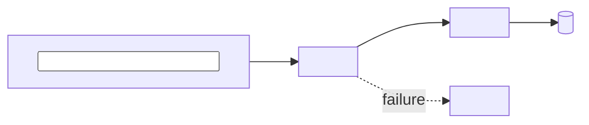

# Architecture overview

## What this repo is

<One line: what it does.>
<One line: what runs it, and where.>
<One line: what it is explicitly not responsible for.>

## Top-level layout

Every top-level directory of this repo appears in this table, including relevant hidden configuration directories. **An omitted directory is a bug**, not an editorial choice — the audit behind this template found a README that never named its repo's own top-level directories and left out `smarthome/` entirely, so an agent reading it concluded that subsystem did not exist. This table is orientation, not a service inventory: architecture can change without any root directory changing.

| Path | Purpose | Owner |
| --- | --- | --- |
| `<dir>/` | <one line> | `@<handle>` |
| `<dir>/` | <one line> | `@<handle>` |
| `docs/` | Canonical documentation; see `docs/README.md`. | `@<handle>` |

Generated, vendored, and build-output directories are listed too, marked as such. A directory you are not supposed to edit still has to be a directory you can recognise.

## Architectural inventory

One row per independently configured service/process, shared component or client contract, entry point/trigger, and delivery definition. Discover nested units and configuration contents, not just root folders. Use the literal kinds `compute`, `component`, `entry`, `delivery` and keep this column order so checks can extract rows mechanically.

| Kind | Name | Path | Purpose | Trigger/Protocol | Base Image/Runtime | Owner |
| --- | --- | --- | --- | --- | --- | --- |
| compute | <service or worker profile> | `<source file or service root>` | <purpose; command definition at file:line or manifest key> | <HTTP / queue binding / schedule> | <runtime or shared base; definition at file:line> | `@<handle>` |
| component | <shared library or client contract> | `<source file or package root>` | <purpose and consumers> | <protocol or n/a> | <runtime or n/a; definition at file:line> | `@<handle>` |
| entry | <command, router or trigger> | `<registration file>` | <target compute unit; definition at file:line or manifest key> | <command / endpoint / event / timer binding> | <runtime or n/a> | `@<handle>` |
| delivery | <workflow or deployment> | `<manifest file>` | <build/deployment targets; definition at file:line or manifest key> | <push / manual / schedule> | <runner/runtime; definition at file:line> | `@<handle>` |

`(Kind, Name, Path)` is the unique identity. Paths are exact repository-relative paths in backticks, without line numbers or wildcards; names are stable and unique within a kind/path. Use `n/a` only where inapplicable. Multiple workers may share a Dockerfile/base image: give each independently configured execution profile a row with its own command and binding, and identify the shared runtime. Do not classify every package or profile as a deployable service without evidence.

**Discovery and verification scope:** <source roots, manifest patterns and configuration parsers covering all four kinds; explicit generated/vendor/local-only exclusions and why>.

Replace `verify:` with a reproducible repository-specific comparison of independent discovery against these rows, in both directions. Check exact identities and execution bindings, not arbitrary text matches or only the paths already in this doc. Parsing errors, missing source paths, unmapped units and removed definitions must fail, not just print a warning. The `repo-architecture` skill provides a manifest comparison example; extend it for shared-manifest profiles and code registrations. A frontmatter lint pass alone does not run this check.

For a PR replay or scheduled reconciliation, rediscover all categories from the working tree, edit this inventory and affected entry points/data flow in place, bump `updated:`, and run `verify:` plus the existing doc linter. Prove the check fails for a new nested unit, removed manifest and changed binding before trusting it.

## How it runs

**Entry points**

| Entry point | Trigger | Target inventory unit | Defined at |
| --- | --- | --- | --- |
| `<command or endpoint>` | <manual / cron / webhook / boot> | <compute/component name> | `<file>:<line>` |

**Data flow**

<Two to four sentences: what enters, what transforms it, where it lands, what is durable.>

```mermaid
flowchart LR
  A[<input source>] --> B[<component>]
  B --> C[<component>]
  C --> D[(<durable store>)]
  B -.failure.-> E[<error path>]
```

Replace every `<placeholder>` above with real component names drawn from the architectural inventory. Names in the diagram must match names used in the code; a diagram with invented labels is worse than no diagram.

## External dependencies

Each row names the decision record that chose it. **If the ADR column is empty, that is a gap — record it under Known gaps and write the ADR.** The audit found ArgoCD, Longhorn, MetalLB, Traefik and external-secrets all adopted with no rationale recorded anywhere; the cost is not the missing paragraph, it is that nobody can tell a deliberate constraint from an accident.

| Dependency | Used for | Pinned at | Chosen by |
| --- | --- | --- | --- |
| `<name>` | <one line> | `<file>:<line>` | `docs/decisions/NNNN-<slug>.md` |
| `<name>` | <one line> | `<file>:<line>` | **no ADR — gap** |

Versions and configuration are referenced by `file:line`, never copied here. A copied version string is a second source of truth and it will disagree first.

## Known gaps

What is true about this repo that this document cannot yet justify. Keep it honest; an empty section is a claim.

- `<gap>` — <why it matters, and the story or ADR that would close it>
- Undocumented decisions: `<dependency>`, `<dependency>` — no ADR.
