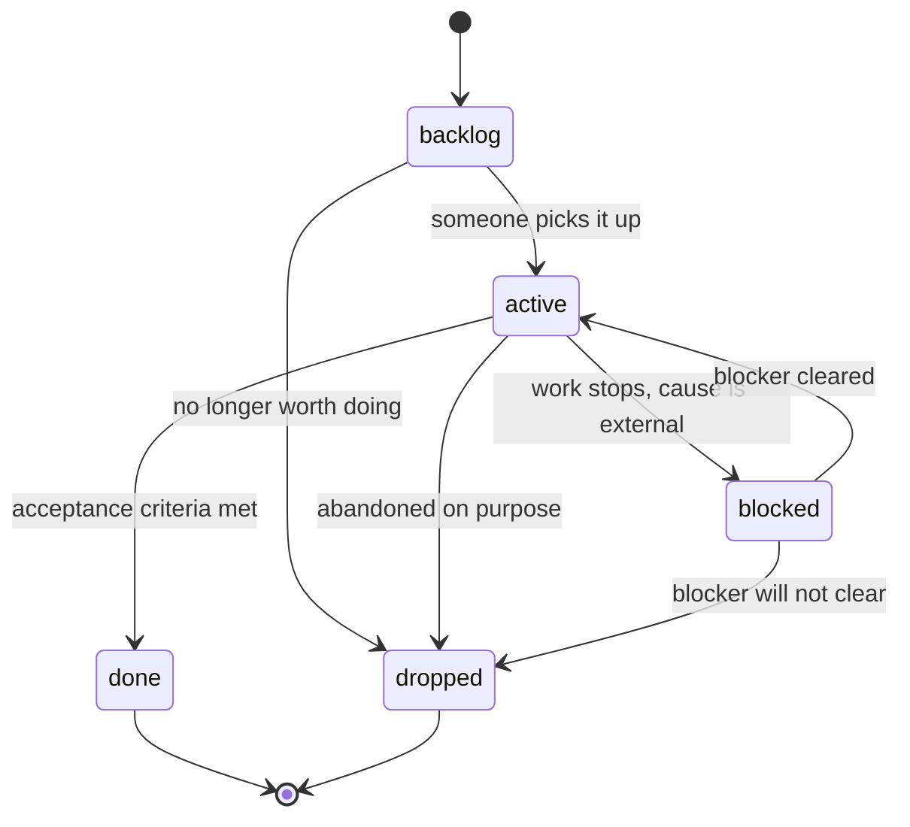

# Stories

A story is one unit of work with a lifecycle. It is `flow` class: mutable while it
is alive, and it leaves this folder when it ends.

Start a new story by copying `TEMPLATE.md` to `docs/stories/<slug>.md`. The `status`
field in frontmatter is the only place the state is recorded — never restate it in
prose, because prose is what goes stale.

## States

| State | Meaning | Where the file lives |
| --- | --- | --- |
| `backlog` | Agreed as worth doing. Nobody is on it. | `docs/stories/` |
| `active` | Someone is working on it right now. | `docs/stories/` |
| `blocked` | Work stopped on something outside this story. | `docs/stories/` |
| `done` | Acceptance criteria met. | `docs/stories/done/` |
| `dropped` | Deliberately abandoned. | `docs/stories/done/` |

## Transitions

Legal transitions are exactly the eight arrows above. Anything else is illegal:

- **`done` and `dropped` are terminal.** To revive a closed story, write a new one
  and link the old file from its `## Notes`. Reopening in place destroys the record
  of what was actually decided the first time.
- **No `blocked` → `backlog`.** Once work has started, the story carries context a
  backlog item does not. Blocked keeps it.
- **No skipping `active`.** A story cannot go straight from `backlog` to `done`; if
  the work was so small it never looked active, it did not need a story.

## The rule that makes this work

**A story never sits in `active` once work stops.** The moment you stop, it moves:
`blocked` with the specific blocker named in `## Notes`, `done` with `## Closing`
filled in, or `dropped` with the reason recorded. There is no fourth option and no
grace period.

Both closing states move the file to `docs/stories/done/`. `dropped` is archived
next to `done` on purpose — an abandoned story is a result, and results are kept.

## Why `dropped` exists as a first-class state

The audit this kit is built from (`docs/research/2026-09-11-workspace-doc-audit.md`)
found plans that nobody ever closed:

- A 707-line plan sitting at **5 of 98 checkboxes** — only the phase unrelated to
  the migration the file was named for ever ran.
- A spec whose header still read `Status: Proposed (PR for review)` months after the
  learning log recorded those PRs merged.

Neither was abandoned by decision. Abandonment was simply not a state anyone could
record, so the files stayed in a permanent, misleading middle. An agent reading
either one cannot tell planned-and-pending from planned-and-dead, so it re-plans the
same work or builds on a plan that was overtaken a quarter ago.

`dropped` costs one line of frontmatter and one line of reason. It is the cheapest
thing in this folder and it is the one that stops a plan from rotting in place.

## Worked example

`docs/stories/metrics-on-status-page.md` is created from `TEMPLATE.md` with
`status: backlog` and three acceptance criteria.

1. Someone picks it up: `status: active`, `updated:` bumped to that day. The file
   does not move.
2. The metrics endpoint turns out to need an auth decision that is not made yet.
   Work stops the same afternoon, so the story moves the same afternoon:
   `status: blocked`, and `## Notes` gains one line —
   `Blocked on: docs/decisions/0007-service-auth.md (status: proposed)`.
   It does not stay `active` overnight.
3. The ADR lands as `accepted`. Back to `status: active`, `updated:` bumped.
4. All three criteria check out. `status: done`, `## Closing` records the date, what
   shipped, and that criterion 3 was narrowed to read-only because the write path
   moved to its own story. The file moves to `docs/stories/done/`.

The blocked step is the one people skip. Skipping it is how a story becomes a
707-line file at 5%.
